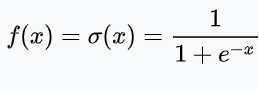

# Sigmoid-Neuron-Model

Learning and Implementing the Sigmoid Neuron Model from Scratch.

A sigmoid function is a mathematical function having a characteristic "S"-shaped curve or sigmoid curve. A common example of a sigmoid function is the logistic function shown in the first figure and defined by the formula:

In this repository, sigmoid function is used as the basis to make a binary classification model to classify the 
